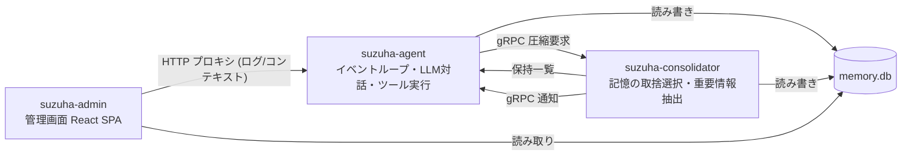
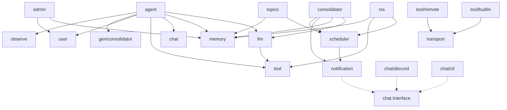

# suzuha アーキテクチャ概要

## プロセス構成

3つの独立したプロセスで構成。共有リソースは memory.db（同一ファイル）。



## パッケージ構成

エントリポイント: `cmd/suzuha-agent`, `cmd/suzuha-consolidator`, `cmd/suzuha-admin`
プロトコル定義: `proto/` → 生成コード `gen/`

コアパッケージ (`internal/`):
- `agent` — エージェントコアループ、短期記憶管理、応答判定
- `consolidator` — 記憶圧縮サービス (gRPC サーバー/クライアント)
- `llm` — LLM クライアント (Complete, Embed)、Message 型
- `memory` — 長期記憶 (SQLite + FTS5 + sqlite-vec)、マイグレーション
- `user` — ユーザー管理、プラットフォームリンク、親和度
- `chat` — プラットフォーム抽象 + 実装 (discord, cli)
- `tool` — ツールインターフェース、Registry、builtin ツール、remote ツール
- `transport` — リモートツール通信 (WebSocket, MCP)
- `notification` — 統一 Notifier インターフェース + Middleware パターン。詳細は `notification.md`
- `scheduler` — 定期実行ジョブ (CronTask, CronContext, Feature, Registry)。Consolidator プロセス内で動作。詳細は `docs/scheduler.md`
- `rss` — Feature: RSS フィード監視（ツール + タスク + DB ストア）
- `topics` — Feature: 定期的な独り言（タスクのみ）
- `admin` — 管理画面バックエンド (REST API + SPA 配信)
- `event` — EventBus (chan ベース)
- `config` — YAML 設定ロード
- `observe` — SQLite-backed メトリクス、slog、ログストリーミング。詳細は `observe.md`

## 依存関係



- リーフ: `event`, `config`（外部依存なし）
- `memory` は agent と consolidator の両方から使用（同一 DB）
- embedding 関数は `main.go` でクロージャとして注入（循環依存回避）

## Feature パターン

機能単位のパッケージ分離。各 Feature は `scheduler.Feature` を実装し、
ツール・タスク・DB セットアップを1つのパッケージにまとめる。

```go
// scheduler/feature.go
type Feature interface {
    Name() string
    Setup(ctx context.Context, db *sql.DB) error  // スキーマ作成等（冪等）
    Tools() []tool.Tool                            // agent 用。なければ nil
    Tasks() []CronTask                             // consolidator 用。なければ nil
}
```

main.go で Feature 配列をループして Setup → Tools/Tasks を登録:
```go
features := []scheduler.Feature{rss.New(db, mem), topics.New()}
for _, f := range features {
    f.Setup(ctx, db)
    for _, t := range f.Tools() { registry.Register(t) }
    for _, t := range f.Tasks() { taskRegistry.Register(t) }
}
```

## 主要インターフェース

- `scheduler.Feature` (`scheduler/feature.go`) — Name, Setup, Tools, Tasks。機能単位パッケージの抽象
- `notification.Notifier` (`notification/notifier.go`) — Send, Reply。統一通知インターフェース。詳細は `notification.md`
- `chat.Interface` (`chat/chat.go`) — Run, Send。プラットフォーム抽象。Optional: `Replier`, `IDSender`。詳細は `notification.md`
- `tool.Tool` (`tool/tool.go`) — Name, Description, InputSchema, Execute。詳細は `tools.md`
- `memory.Store` (`memory/store.go`) — Save, Search, SearchByType, SearchRecent。詳細は `data.md`
- `memory.AdminStore` — Store + List, Get, Update, Delete（管理画面用）
- `consolidator.Client` (`consolidator/consolidator.go`) — Compact。詳細は `data.md`
- `user.Store` (`user/user.go`) — Resolve, Get, UpdateDisplayName, UpdateAffinity, GetAffinity。詳細は `data.md`
- `transport.Transport` (`transport/transport.go`) — Connect, Send, Receive, Close。詳細は `tools.md`
