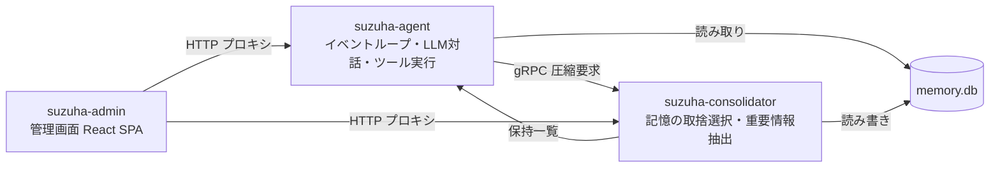
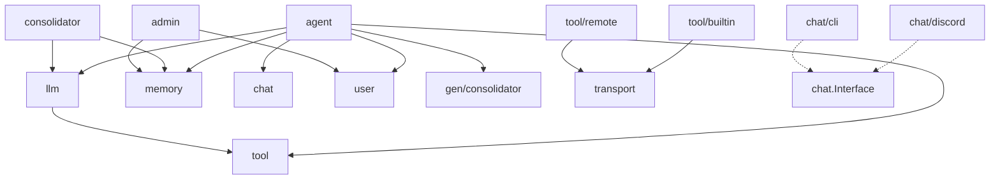

# suzuha アーキテクチャ概要

## プロセス構成

3つの独立したプロセスで構成。共有リソースは memory.db（同一ファイル）。

## パッケージ構成

エントリポイント: `cmd/suzuha-agent`, `cmd/suzuha-consolidator`, `cmd/suzuha-admin`
プロトコル定義: `proto/` → 生成コード `gen/`

コアパッケージ (`internal/`):
- `agent` — エージェントコアループ、短期記憶管理、応答判定
- `consolidator` — 記憶圧縮サービス (gRPC サーバー/クライアント)
- `llm` — LLM クライアント (Complete, Embed)、Message 型
- `memory` — 長期記憶 (SQLite + FTS5 + sqlite-vec)、マイグレーション
- `user` — ユーザー管理、プラットフォームリンク、親和度
- `chat` — プラットフォーム抽象 + 実装 (discord, cli)
- `tool` — ツールインターフェース、Registry、builtin ツール、remote ツール
- `transport` — リモートツール通信 (WebSocket, MCP)
- `admin` — 管理画面バックエンド (REST API + SPA 配信)
- `event` — EventBus (chan ベース)
- `config` — YAML 設定ロード
- `observe` — Prometheus メトリクス、slog、ログストリーミング

## 依存関係

- リーフ: `event`, `config`, `observe`（外部依存なし）
- `memory` は agent と consolidator の両方から使用（同一 DB）
- embedding 関数は `main.go` でクロージャとして注入（循環依存回避）

## 主要インターフェース

- `chat.Interface` (`chat/chat.go`) — Run, Send。プラットフォーム抽象
- `tool.Tool` (`tool/tool.go`) — Name, Description, InputSchema, Execute。詳細は `tools.md`
- `memory.Store` (`memory/store.go`) — Save, Search, SearchByType, SearchRecent。詳細は `data.md`
- `memory.AdminStore` — Store + List, Get, Update, Delete（管理画面用）
- `consolidator.Client` (`consolidator/consolidator.go`) — Compact。詳細は `data.md`
- `user.Store` (`user/user.go`) — Resolve, Get, UpdateDisplayName, UpdateAffinity, GetAffinity。詳細は `data.md`
- `transport.Transport` (`transport/transport.go`) — Connect, Send, Receive, Close。詳細は `tools.md`
