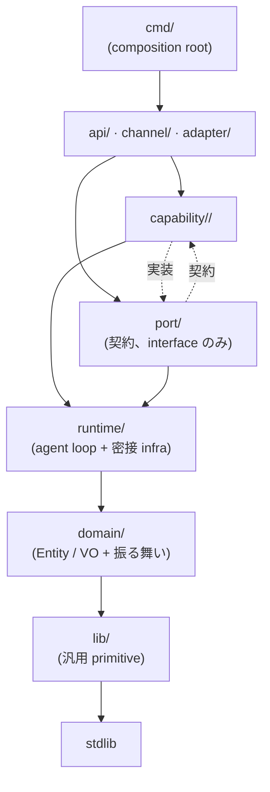

## 採用アーキテクチャ

**Hexagonal (Ports & Adapters) × Vertical Slice** の coherent hybrid。

- **Horizontal 層**: 技術的横断 — `port/`, `adapter/`, `domain/`, `lib/`, `runtime/`, `observe/`, `api/`, `channel/`, `di/`
- **Vertical 層**: 業務 domain slice — `capability/<name>/` (flat 配置、`capability/` が wrapper dir)
- 各 slice は port 公開を **内部 configuration** として持つ (identity には影響しない)
- capability / behavior の top-level 分離は **廃止**。ビジネス package はすべて `capability/` 配下

採用理由・code example は `docs/architecture/architecture-rationale.md`。実装 skeleton 詳細は `capability-template.md`。

## 全体構造

```
agent/internal/
  ┌─ Horizontal (技術層、複数 capability から共有) ──
  port/          # interface 契約 (driving + driven)
  adapter/       # port 実装 (外部 SDK / 永続化)
  domain/        # Entity / VO + 型の振る舞い (rich domain)
  lib/           # stdlib 補完 primitive (project 非依存)
  runtime/       # agent loop + 密接な infrastructure
  observe/       # metrics / tracing / log (副作用あり、層規約対象外)
  api/           # HTTP サーフェス (driving adapter)
  channel/       # I/O protocol (driving adapter): discord / web / cli / device
  di/            # composition root (全層 wire)
  ┌─ Vertical (業務 domain slice) ──
  capability/    # 業務機能 (flat 配置)
    action/
    builtin/
    conversation/
    llm/
    mcp/
    memory/
    research/
    video/
    vision/
    voice/
```

## 依存方向



**ルール**:
- `runtime/` は capability の **個別名を知らない** (port 経由のみ)
- `adapter/` は `port/`, `domain/`, `lib/`, `observe/` のみ import 可
- `port/` は実装 (capability / adapter / runtime) を一切 import しない
- `domain/` は `lib/` と stdlib のみ import
- **sibling 間の直接 import 禁止** (capability 同士、channel 同士、adapter 同士、api 同士)
- `observe/` は層規約対象外。誰でも import 可
- `di/` は composition root ゆえ全層 import 可

## 各層の置く / 置かない

### `port/`
| 置く | 置かない |
|---|---|
| interface 定義 (driving + driven) | struct 実装 / helper |
| interface signature 専用の request/response 型 | business logic |
| domain 型への参照 (import のみ) | default 実装 / factory |
| interface 固有の marker error | 副作用 / I/O |

### `adapter/`
| 置く | 置かない |
|---|---|
| `port/<X>` 実装 struct | business logic (→ `capability/`) |
| 外部 SDK 呼び出し | domain 型の定義 (→ `domain/`) |
| domain 型 ↔ SDK 型の mapping | 他 adapter の import (sibling 禁止) |
| DB schema migration (`adapter/store/<X>/migrations/`) | 純計算 (→ `lib/` or `domain/`) |

配置: `adapter/<category>/<vendor>/` (multi-vendor) or `adapter/<name>/` (単一実装)

### `domain/`
| 置く | 置かない |
|---|---|
| Entity (identity を持つ型) | interface (→ `port/`) |
| Value Object (value で等価) | I/O (DB / HTTP / file) |
| 型の method (不変条件、純計算) | 外部 SDK 型 |
| domain 特化の enum / 定数 / error 型 | orchestration (→ `capability/`) |

**rich domain が前提**。貧血 (データだけ) は禁止。

### `lib/`
| 置く | 置かない |
|---|---|
| stateless 関数群 | **domain 型に依存するコード** (→ `domain/<name>/`) |
| 汎用 primitive (time, crypto, text) | project-specific logic |
| 外部 lib の薄い wrapper (project 非依存) | 副作用 (観測・送信 → `observe/` or `adapter/`) |

### `runtime/`
| 置く | 置かない |
|---|---|
| agent loop (Perceive / Think / Act / Reflect) | capability の個別名 |
| port 実装 (scheduler / event / toolregistry / gateway) | business logic |
| application orchestrator | domain 型の定義 |

**注**: `runtime/` は application layer + agent loop に密接な infrastructure の混在を許容。strict Hexagonal では adapter に分ける選択肢もあるが、実用性で runtime 残留としている。

### `channel/`
| 置く | 置かない |
|---|---|
| Source (入力受信) | business logic (→ `capability/` の port 経由) |
| Session 実装 (protocol 固有) | 他 channel の import |
| Sender (送信) | domain 型の定義 |
| protocol 固有 Tool (`channel/<X>/tool_*.go` or `channel/<X>/tool/`) | capability の直接 import |

### `api/`
| 置く | 置かない |
|---|---|
| HTTP handler (thin、capability 呼び出しのみ) | business logic |
| ogen 生成コード (`gen/`) | domain 型の定義 |
| middleware | 他 surface の import (admin ↔ control 禁止) |

### `observe/`
| 置く | 置かない |
|---|---|
| metrics / span / log / trace util | business logic |
| structured log helper | domain 型の定義 |
| trace context propagation | port 契約 |

**層規約対象外**。副作用 OK、誰でも import 可。

### `di/`
| 置く | 置かない |
|---|---|
| 全層の wiring | business logic |
| constructor 呼び出し | domain 型の定義 |
| `providers.go` / `adapters.go` 等 | sibling 間結合 |

### `capability/<X>/`
詳細は `capability-template.md`。概要:
- `<name>.go` facade (thin)
- responsibility sub-package (大きい capability で使用)
- `store`, `task`, `tool`, `handler` は concern ごとに平置き or sub-pkg 化

## capability 内部構造の可変性

**粒度揃えすぎを避ける**。capability の規模に応じて柔軟に:

### 小さい capability (`builtin`, `research` 等)
```
capability/<name>/
  <name>.go
  <verb>.go
  tool_<v1>.go        # tool 数 2-3 なら平置き OK
  tool_<v2>.go
  <name>_test.go
```

### 中規模 capability (`conversation`, `vision` 等)
```
capability/<name>/
  <name>.go
  store.go + postgres.go
  <verb>.go
  tool/<verb>.go      # tool 数が 4+ なら sub-pkg
  <resp>/             # 独立責務があれば sub-pkg
```

### 大規模 capability (`memory`)
```
capability/memory/
  memory.go              # facade
  acquire/               # 責務 sub-pkg
  consolidate/
  forget/
  summarize/
  store/
  tool/
```

**選択基準**:
- 責務が 3 個以上 → responsibility sub-pkg 必須
- tool が 4 個以上 → `tool/` sub-pkg 推奨
- store schema / query 群が大きい (migration 多数、query helper 分割必要) → `store/` sub-pkg
- それ以外 → 平置き OK

## ドメインモデル (rich)

**貧血モデル禁止**。I/O 非依存の振る舞いは domain 型の method として持たせる。

境界判定:

| 問い | YES の配置 |
|---|---|
| 型単体で答えられるか (store / 外部呼び出し不要) | `domain/<X>/` の method |
| store / 他 capability に問い合わせ必要 | `capability/<X>/<resp>/` |
| stdlib で書けるプリミティブ (時刻・文字列・正規化) | `lib/<name>/` |
| 副作用あり (log / metric / trace 送信) | `observe/` or `adapter/<X>/` |

例:
- `domain/message.Message.IsFromAgent()` → 型単体 → domain
- `domain/memo.Memo.CanMergeWith(other Memo) bool` → 型単体 → domain
- `capability/memory/consolidate.Service.Consolidate(ctx)` → store 参照 + LLM 呼び出し → capability

`domain/` のルール:
- I/O (DB / HTTP / file) に触れない
- 外部 SDK 型を返さない
- stateless (グローバル可変状態なし)
- `lib/` と stdlib 以外は import しない

## 配置判定

### 新規の型
「別 package の import 文に書きたくなるか?」YES → `domain/<name>/`。NO → その package 内。

### 新規の interface
- 複数 consumer で共有 → `port/<name>/`
- 1 package 内だけで使う → その package 内 (consumer-side、Go 慣習)

### 新規のロジック
| 性質 | 配置先 |
|---|---|
| I/O 非依存、型単体 | `domain/<X>/` の method |
| I/O 必要 or orchestration | `capability/<X>/<resp>/` |
| 汎用 primitive (project 非依存) | `lib/<name>/` |
| 副作用 (log / metric 送信) | `observe/` |

### 新規の Tool
| Tool の性質 | 配置先 |
|---|---|
| プロトコル固有 (Discord voice, device LED 等) | `channel/<name>/tool_<verb>.go` or `channel/<name>/tool/<verb>.go` |
| capability 機能を LLM に公開 | `capability/<name>/tool_<verb>.go` or `capability/<name>/tool/<verb>.go` |
| capability 組み合わせの独立行動 | `capability/<name>/tool_<verb>.go` (当該 capability 内) |
| 汎用 Tool (どの capability にも属さない) | `capability/builtin/tool_<verb>.go` |

共通: `port/tool.Tool` 実装、DI で tool registry に register、**1 tool = 1 ファイル**。

### 新規の Task (scheduler)
- capability のライフサイクル維持 (maintenance) → `capability/<X>/task.go` or `capability/<X>/task/<task>.go`
- LLM 自律パターン (研究、予約実行、動画理解等) → 該当 capability 内で同様に配置

## Import 許可表

| from → to | OK |
|---|---|
| `cmd/` → 任意 | ✓ DI 配線 |
| `adapter/X/` → `port/X/`, `domain/`, `lib/`, `observe/` | ✓ |
| `capability/X/` → `port/`, `domain/`, `lib/` | ✓ |
| `capability/X/` → `runtime/` | △ 最小限 (port で間に合わないとき) |
| `channel/X/` → `port/`, `runtime/`, `domain/`, `lib/` | ✓ |
| `api/{admin,control}/` → `capability/`, `runtime/`, `port/` | ✓ |
| `api/<X>/` → `api/<X>/gen/` | ✓ 自サーフェスの ogen コード |
| `runtime/` → `port/`, `domain/`, `lib/` | ✓ |
| `port/` → `domain/`, `lib/` | ✓ interface 引数型 |
| `domain/` → `lib/`, stdlib | ✓ |

## Import 禁止表

| from → to | ✕ | 理由 |
|---|---|---|
| `adapter/` → `capability/`, `runtime/`, `channel/`, `api/` | ✕ | 層逆行 |
| `port/` → `capability/`, `runtime/`, `adapter/` | ✕ | 契約は実装を知らない |
| `runtime/` → `capability/`, `channel/`, `api/`, `adapter/` | ✕ | runtime は plugin を知らない |
| `capability/X/` ↔ `capability/Y/` | ✕ | sibling 禁止、`port/Y/` 経由のみ |
| `channel/X/` ↔ `channel/Y/` | ✕ | sibling 禁止 |
| `adapter/X/` ↔ `adapter/Y/` | ✕ | sibling 禁止 |
| `api/<X>/` → `api/<Y>/` | ✕ | admin と control は独立 |
| `domain/` → 任意 (`lib/` 除く) | ✕ | 純データ + 振る舞いのみ |
| `lib/` → 任意の internal package | ✕ | プリミティブ |

## Never

- adapter が他の adapter を import
- capability 同士を直接 import (`port/` 経由で)
- domain が adapter / external SDK を import
- port が実装 (capability / adapter / runtime) を import
- `utils` / `helpers` / `common` / `misc` / `base` / `shared` package 名
- `init()` 関数 / グローバル可変状態 (`go-conventions.md` 参照)
- 1 ファイルに複数 Tool / 複数 Task を混在

## 3 つの失敗パターン

coherent hybrid が壊れる典型 pattern:

### 1. 共通化の誘惑に負ける
「他の capability でも使いそうだから `lib/` に置こう」で早期共通化すると、capability が lib に強く依存し独立して閉じなくなる。

**防衛**: **3 回以上の consumer が出現してから** 共通化する。1-2 consumer なら各 capability 内に duplicate しておく方がまし。

### 2. レイヤーの方向を曖昧にする
依存方向を一方向に固定しないと循環依存と配置判断の迷いが発生する。

**防衛**: depguard rule で強制 (下記 § 強制)。baseline exemption なし。

### 3. 層の粒度を揃えすぎる
「全 capability に store/task/tool/handler を必ず置く」のような硬直化をやると、小さい capability が無駄に肥大化する。

**防衛**: capability 内部構造は可変。小さければ平置き、大きければ sub-pkg。§ capability 内部構造の可変性 参照。

## 強制 (strict モード)

- `.golangci.yml` の depguard rule で静的検知、**baseline exemption なし**
- 違反はすべてビルドエラー (`golangci-lint run` が non-zero exit)
- `scripts/update-depguard-baseline.sh` は出力 0 行を期待、非空は回帰として扱う
- 新パッケージ / 境界を追加するときは depguard rules も同 PR で更新
- depguard 設定サンプルは `docs/architecture/architecture-rationale.md` § 3
