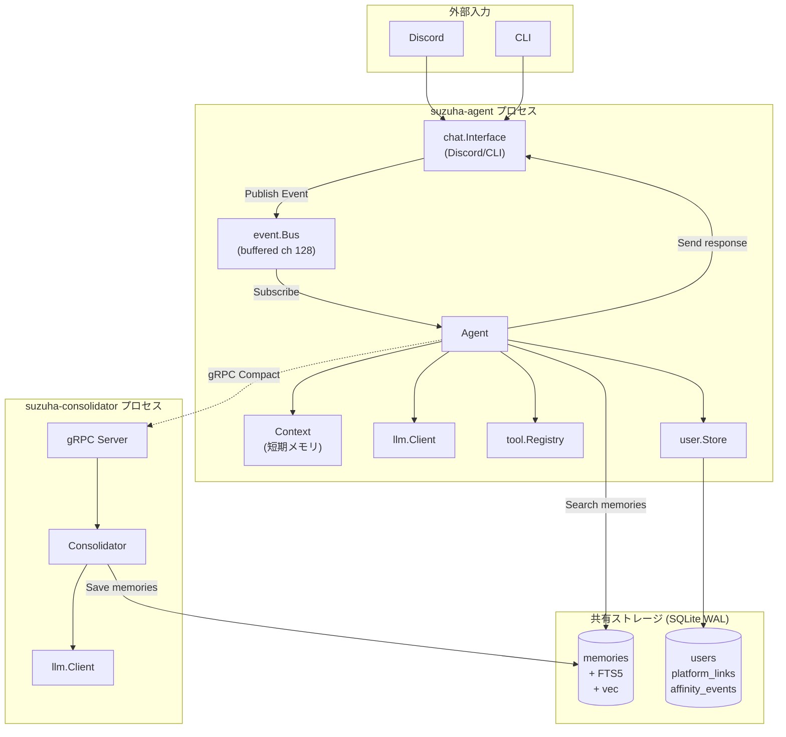
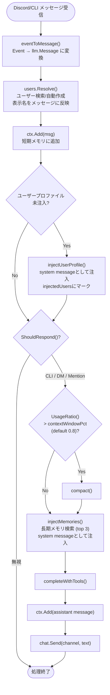
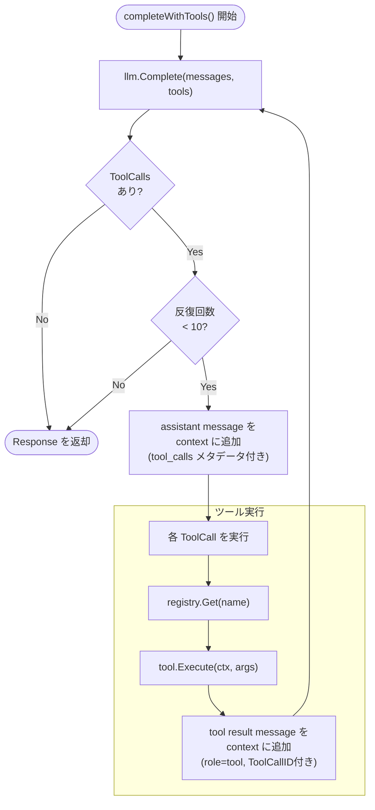
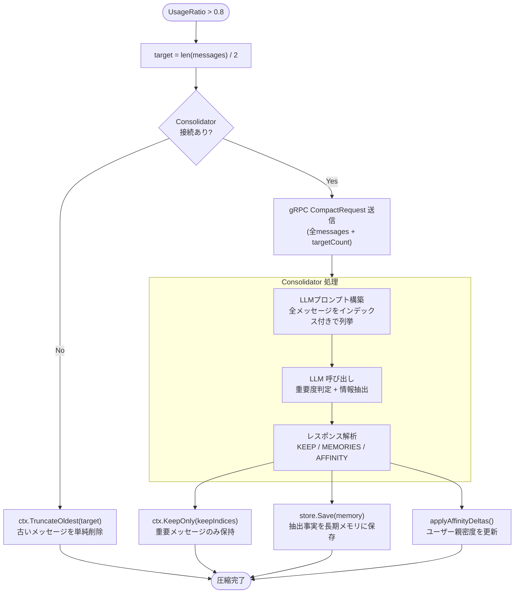
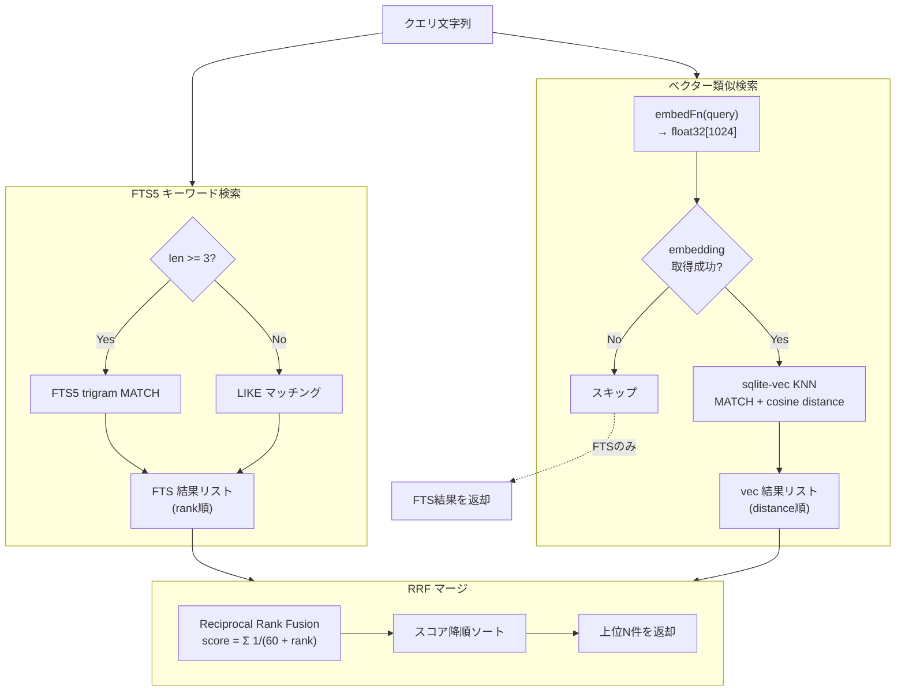
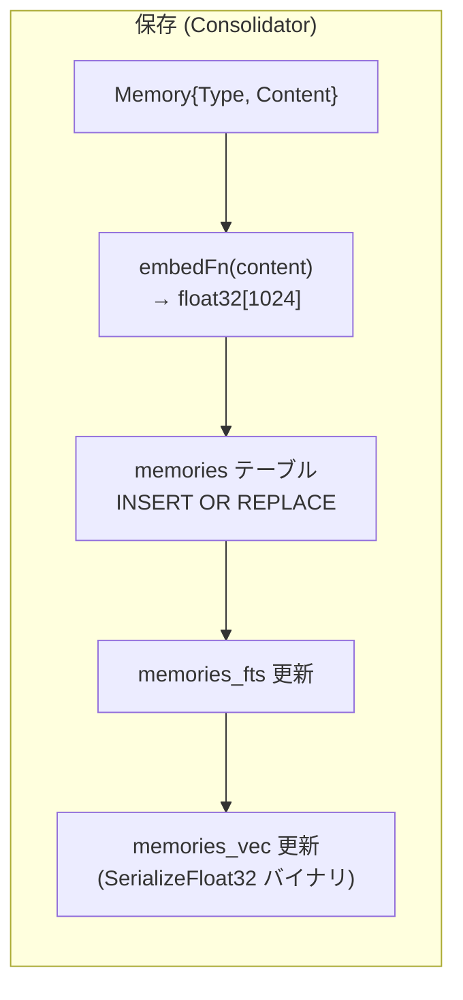
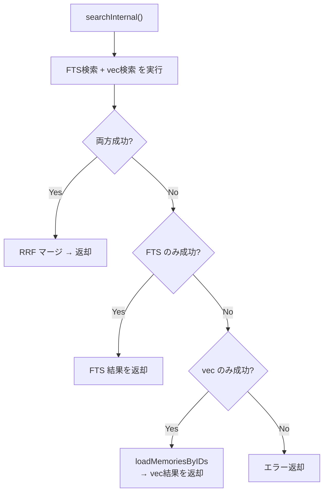
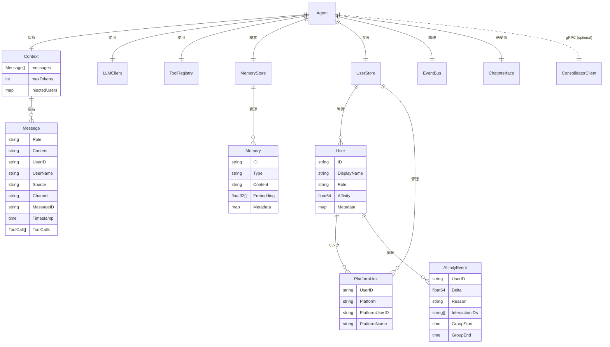
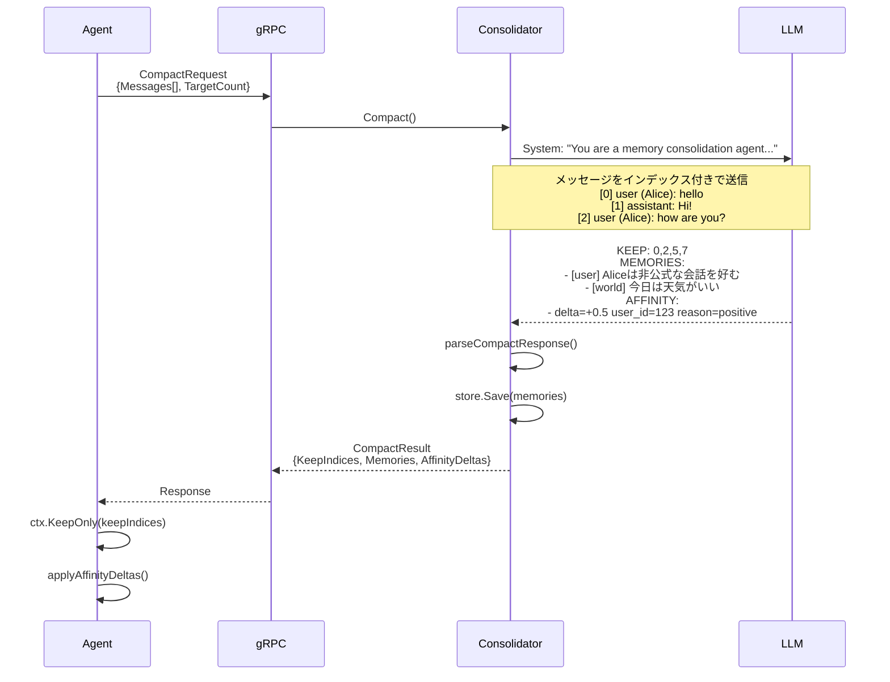
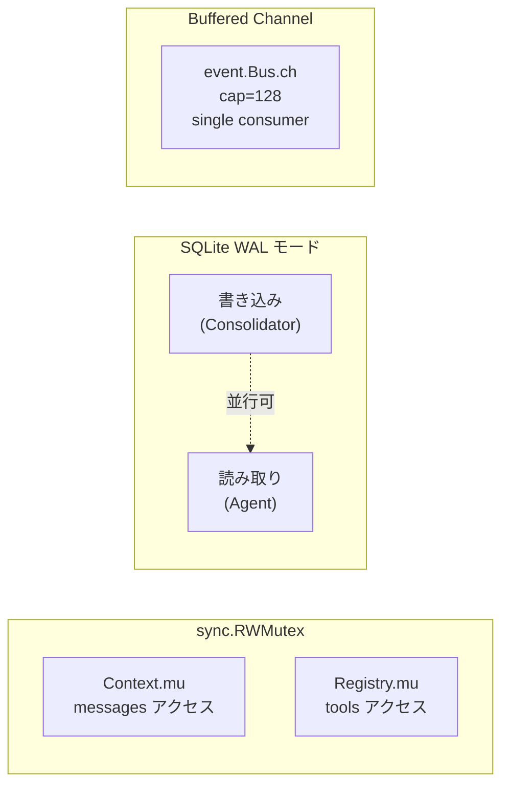

# エージェント コンテキスト管理

## 全体アーキテクチャ

## イベント処理パイプライン

ユーザー入力からレスポンスまでの全フロー。

## ツール実行ループ

`completeWithTools()` 内の最大10回のツール実行ループ。

## コンテキストウィンドウ管理

短期メモリの圧縮と長期メモリへの退避フロー。

## メモリ検索・保存フロー

### ハイブリッド検索 (FTS5 + sqlite-vec KNN + RRF)

### 保存フロー

### グレースフルデグラデーション

## データモデル関係図

## Consolidator 圧縮プロトコル

Consolidator が LLM に送るプロンプトと応答のフォーマット。

## スレッドセーフティ

