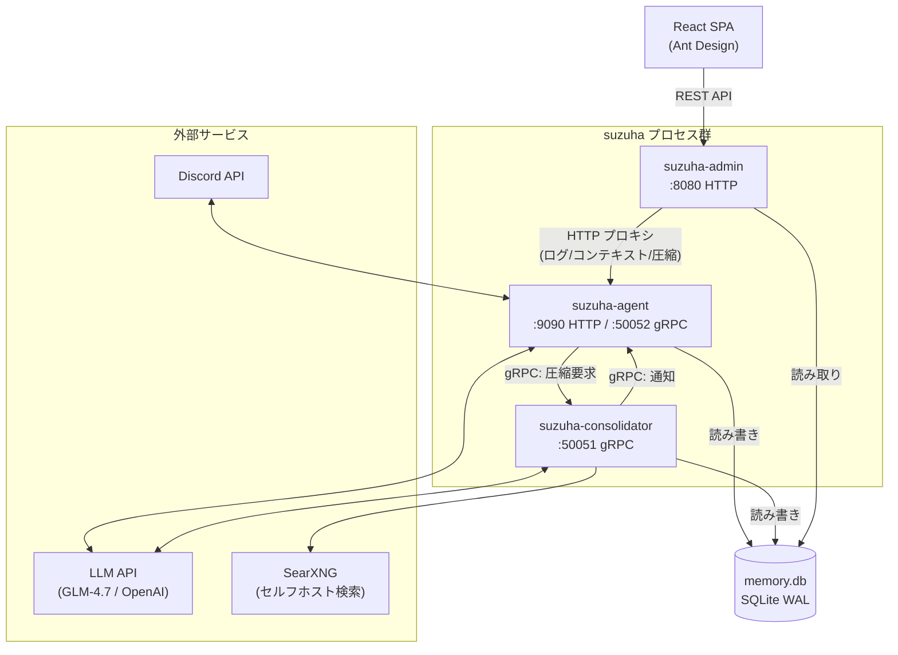
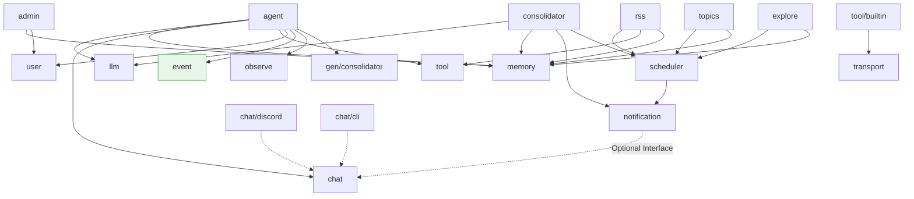
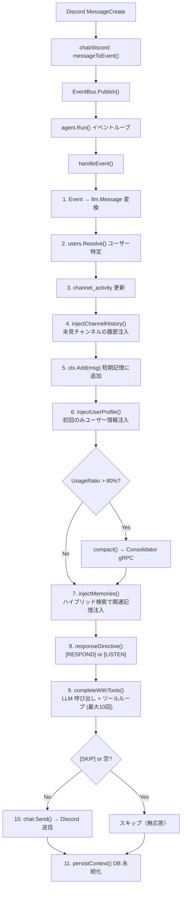
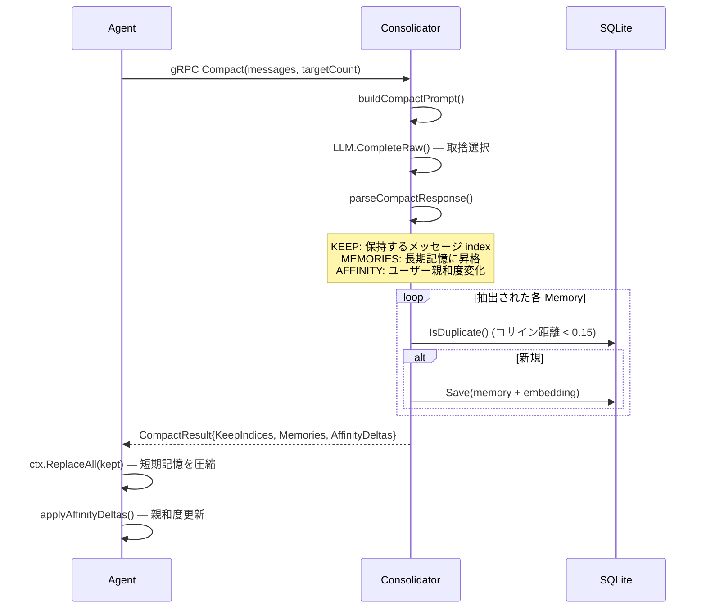
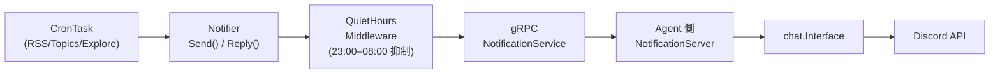
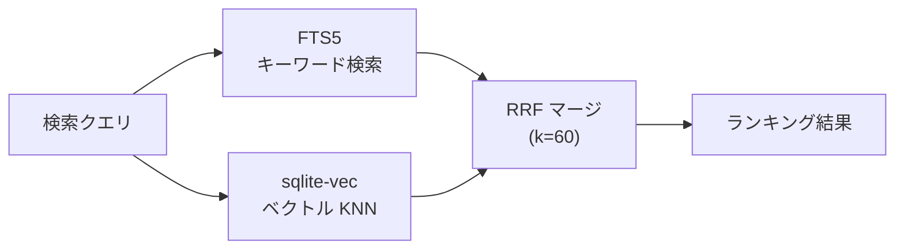
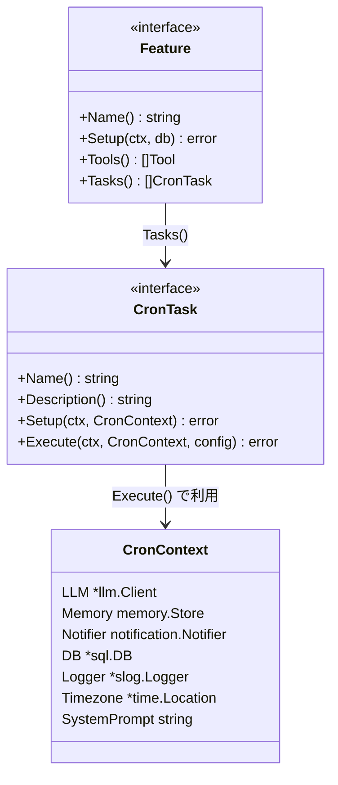

# suzuha アーキテクチャ全体図

## システム全体構成

Go 1.26 製の Discord ボット。LLM 対話・長期記憶・定期タスクを 3 プロセス構成で実現する。



### プロセス一覧

| プロセス | 役割 | ポート |
|---------|------|--------|
| **suzuha-agent** | Discord イベント受信・LLM 対話・ツール実行・応答送信 | 9090 (HTTP), 50052 (gRPC) |
| **suzuha-consolidator** | 記憶圧縮 (gRPC) + Cron スケジューラ（RSS/独り言/探索） | 50051 (gRPC) |
| **suzuha-admin** | 管理画面 REST API + React SPA 配信 | 8080 (HTTP) |

3 プロセスは同一 SQLite DB (`memory.db`) を WAL モードで共有する。

---

## パッケージ構成

```
cmd/
  suzuha-agent/           # Agent エントリポイント
  suzuha-consolidator/    # Consolidator エントリポイント
  suzuha-admin/           # Admin エントリポイント

internal/
  ┌─ コア ──────────────────────────────────
  │  agent/               エージェントコアループ・短期記憶管理・応答判定
  │  consolidator/        記憶圧縮サービス (gRPC サーバー/クライアント)
  │  admin/               管理画面バックエンド
  │    handler/           REST API ハンドラ群
  │    middleware/         CORS, ログ
  │
  ├─ データ ─────────────────────────────────
  │  memory/              長期記憶 (SQLite + FTS5 + sqlite-vec)
  │    migrations/        goose SQL マイグレーション
  │  user/                ユーザー管理・プラットフォームリンク・親和度
  │
  ├─ プラットフォーム抽象 ──────────────────
  │  chat/                Interface, Replier, IDSender
  │    discord/           Discord 実装 (discordgo)
  │    cli/               CLI 実装 (stdin/stdout)
  │
  ├─ LLM・ツール ────────────────────────────
  │  llm/                 LLM クライアント (Complete, Embed)
  │  tool/                ツール Registry + Tool インターフェース
  │    builtin/           組み込みツール群
  │  transport/           リモートツール通信 (WebSocket, MCP)
  │
  ├─ Feature (プラグイン) ──────────────────
  │  rss/                 RSS フィード監視（ツール + タスク + DB）
  │  topics/              独り言（退屈度ベース、タスクのみ）
  │  explore/             自律探索（Wikipedia + SearXNG、タスクのみ）
  │  schedule/            スケジュール管理
  │
  ├─ インフラ ───────────────────────────────
  │  scheduler/           CronTask, CronContext, Feature, Registry
  │  notification/        統一 Notifier + Middleware + gRPC サーバー
  │  event/               EventBus (chan ベース)
  │  observe/             SQLite メトリクス + slog + ログストリーミング
  │  config/              YAML 設定ロード
  │
proto/                    Protobuf 定義
gen/                      Protobuf 生成コード
web/admin/                React SPA (Vite + Ant Design)
```

### パッケージ依存関係



---

## メッセージ処理フロー（Agent コアループ）

Discord メッセージ受信から応答送信までの全体フロー。



### 応答判定ロジック

```
メッセージ種別の判定
├── DM / @メンション / CLI / トリガー → [RESPOND] 「必ず返答」
└── 通常チャンネルメッセージ           → [LISTEN] 「混ざりたければ返答、不要なら [SKIP]」
```

---

## 記憶圧縮パイプライン

コンテキストウィンドウの 80% を超えると Consolidator に圧縮を依頼する。



### フォールバック

Consolidator 不通時 → Agent 側で `TruncateOldest()` により古いメッセージを切り捨て。

---

## 通知パイプライン（Consolidator → Discord）

Consolidator の定期タスクから Discord にメッセージを送信するフロー。



### Agent 側のルーティング

```
reply_to_message_id あり？
├── Yes → chat が Replier？
│     ├── Yes → SendReply()
│     └── No  → Send() (フォールバック)
└── No  → chat が IDSender？
      ├── Yes → SendWithID()
      └── No  → Send()
```

---

## 長期記憶（ハイブリッド検索）



| 記憶タイプ | 用途 |
|-----------|------|
| `user` | ユーザーに関する情報（metadata に `user_id`） |
| `world` | 一般的な知識・事実 |
| `tool` | ツール使用パターン・結果 |
| `rss` | RSS 記事 |

### テーブル構成

- `memories` — メインテーブル (id, type, content, metadata JSON, timestamps)
- `memories_fts` — FTS5 全文検索インデックス (trigram)
- `memories_vec` — sqlite-vec ベクトルインデックス (1024次元 float32)

重複判定: コサイン距離 < 0.15 で同一記憶と判定。

---

## Feature（プラグイン）パターン

各機能は `scheduler.Feature` インターフェースを実装し、ツール・タスク・DB セットアップを 1 パッケージにまとめる。



### 組み込み Feature 一覧

| Feature | パッケージ | Agent ツール | Cron タスク | 概要 |
|---------|-----------|-------------|-------------|------|
| **RSS** | `internal/rss/` | subscribe, unsubscribe, list, preference | `*/30 * * * *` | フィード監視 → ベクトルフィルタ → LLM スコアリング → 通知 |
| **Topics** | `internal/topics/` | なし | `0 * * * *` | 退屈度ベースの独り言生成 |
| **Explore** | `internal/explore/` | なし | `0 */3 * * *` | Wikipedia → SearXNG 連想探索 → 記憶保存 |
| **Schedule** | `internal/schedule/` | あり | あり | スケジュール管理 |

---

## 管理画面

### バックエンド API

```
/api/
├── health                          ヘルスチェック
├── memories/                       長期記憶 CRUD + 検索
│   ├── {id}
│   ├── vec-stats                   ベクトル埋め込み統計
│   ├── with-vec                    埋め込み有無付きリスト
│   └── duplicates                  類似記憶検出
├── users/                          ユーザー管理
│   └── {id}/
│       ├── affinity                親和度履歴
│       ├── guilds                  ギルド/チャンネル
│       └── memories                ユーザー関連記憶
├── guilds/                         ギルド一覧
│   └── {id}/channels
├── channels/                       チャンネル一覧
├── metrics/json                    SQLite メトリクス
├── scheduled-actions/              スケジュールアクション CRUD
├── feeds/                          RSS フィード CRUD
│   ├── {id}/items
│   └── stats
├── prompts/                        IDENTITY.md / SOUL.md 編集
│   └── {name}
├── context                         Agent 短期記憶プロキシ
├── logs/stream                     SSE ログストリーム
└── agent/compact                   強制圧縮プロキシ
```

### フロントエンド (React SPA)

```
web/admin/src/
├── routes/
│   ├── index.tsx           Dashboard（概要）
│   ├── memories/           長期記憶管理
│   │   ├── index.tsx       一覧 + 検索
│   │   └── $id.tsx         詳細・編集
│   ├── feeds/              RSS フィード管理
│   ├── users/              ユーザー一覧・詳細・親和度
│   ├── actions.tsx         スケジュールアクション
│   ├── prompts.tsx         プロンプト編集
│   ├── metrics.tsx         メトリクス可視化
│   ├── context.tsx         短期記憶ビューア
│   └── logs.tsx            リアルタイムログ (SSE)
├── hooks/                  API 呼び出しフック
└── lib/api.ts              REST API クライアント
```

---

## 主要インターフェース一覧

| インターフェース | 定義場所 | 実装 | 役割 |
|----------------|---------|------|------|
| `chat.Interface` | `chat/chat.go` | discord, cli | プラットフォーム抽象 (Run, Send) |
| `chat.Replier` | `chat/chat.go` | discord | リプライ送信 (Optional) |
| `chat.IDSender` | `chat/chat.go` | discord | メッセージ ID 付き送信 (Optional) |
| `tool.Tool` | `tool/tool.go` | builtin/* | ツール実行 |
| `memory.Store` | `memory/store.go` | SQLiteStore | 長期記憶の検索・保存 |
| `memory.AdminStore` | `memory/store.go` | SQLiteStore | 管理画面用 CRUD |
| `consolidator.Client` | `consolidator/` | GRPCClient | 記憶圧縮要求 |
| `notification.Notifier` | `notification/` | GRPCNotifier, NopNotifier | 統一通知 |
| `scheduler.Feature` | `scheduler/` | rss, topics, explore, schedule | 機能プラグイン |
| `scheduler.CronTask` | `scheduler/` | 各 Feature 内 Task | 定期実行ジョブ |
| `user.Store` | `user/user.go` | SQLiteStore | ユーザー管理・親和度 |

---

## Docker 構成

```yaml
# docker-compose.yaml
services:
  agent:          # Go — ポート 9090
  consolidator:   # Go — gRPC 50051 (内部)
  admin:          # Go — ポート 8080
  admin-frontend: # Node 22 — Vite dev server 5173
  searxng:        # セルフホスト検索エンジン
```

DB (`memory.db`) は `./data:/data` ボリュームで agent, consolidator, admin が共有。

---

## 主要ライブラリ

| ライブラリ | 用途 |
|-----------|------|
| `bwmarrin/discordgo` | Discord API |
| `mozilla-ai/any-llm-go` | LLM プロバイダ抽象 (OpenAI 互換) |
| `mattn/go-sqlite3` | SQLite ドライバ (CGO) |
| `asg017/sqlite-vec-go-bindings` | sqlite-vec ベクトル検索 |
| `pressly/goose/v3` | DB マイグレーション |
| `robfig/cron/v3` | Cron スケジューラ |
| `google.golang.org/grpc` | gRPC (Agent ↔ Consolidator) |
