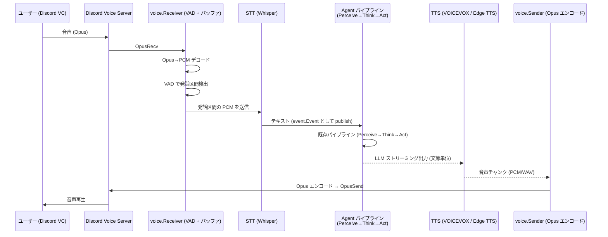

# Voice Chat アーキテクチャ

Discord ボイスチャンネルに参加し、リアルタイム音声対話を行う機能の設計。

参考: [CyberAgent - LLM音声対話システムの応答高速化](https://developers.cyberagent.co.jp/blog/archives/44592/)

---

## 全体フロー



### ポイント

- Agent パイプラインは **テキストのまま既存ロジックを通る**。音声固有の変更は不要
- 高速化の鍵は **文節単位ストリーミング TTS**。全文生成を待たず、句読点区切りで逐次合成する
- ユーザーの音声は **discordgo の VoiceConnection.OpusRecv** で受信。特別なインフラ不要

---

## コンポーネント構成

```
internal/
  voice/
    receiver.go       VC参加 + Opus受信 + PCMデコード + VADバッファリング
    sender.go         PCM→Opusエンコード + VC送信
    vad.go            Voice Activity Detection (発話区間検出)
    session.go        音声セッション管理 (VC参加/離脱, 話者識別)
    pipeline.go       音声→テキスト→パイプライン→音声の橋渡し
  stt/
    stt.go            STT インターフェース
    whisper.go        Whisper 実装 (whisper.cpp HTTP API)
  tts/
    tts.go            TTS インターフェース
    voicevox.go       VOICEVOX 実装
    edge.go           Edge TTS 実装 (フォールバック)
  chat/
    discord/
      discord.go      既存テキスト (変更なし)
      voice.go        新規: VC 関連ハンドラ・コマンド
```

---

## 各コンポーネント詳細

### 1. 音声受信 (voice.Receiver)

```
Discord VC
  → discordgo VoiceConnection.OpusRecv (per-user SSRC)
  → Opus→PCM デコード (gopus / hraban/opus)
  → 話者ごとにバッファリング
  → VAD で発話終了検出
  → PCM チャンクを STT に渡す
```

**話者識別**: discordgo は SSRC→UserID のマッピングを `VoiceSpeakingUpdate` イベントで提供する。
これにより誰が喋っているか特定でき、既存の `user.Store` と紐付けられる。

### 2. VAD (Voice Activity Detection)

発話の開始/終了を検出し、STT に渡す区間を決定する。

| 候補 | 特徴 |
|------|------|
| **Silero VAD** | ONNX モデル、高精度、Go から ONNX Runtime 経由で利用可能 |
| **WebRTC VAD** | C ライブラリ、軽量、Go バインディングあり |
| **エネルギーベース** | 単純な音量閾値、実装は簡単だがノイズに弱い |

推奨: **Silero VAD** (精度と速度のバランスが良い)

パラメータ:
- `speech_threshold`: 0.5 (発話開始判定)
- `silence_duration`: 500ms (この間無音なら発話終了と判定)
- `min_speech_duration`: 250ms (短すぎる発話を無視)

### 3. STT (Speech-to-Text)

```go
type STT interface {
    // Transcribe は PCM 音声をテキストに変換する。
    Transcribe(ctx context.Context, audio []byte, sampleRate int) (string, error)
}
```

| 候補 | 速度 | 精度 | セルフホスト |
|------|------|------|-------------|
| **whisper.cpp (HTTP)** | 速い (GPU) | 高い | Docker コンテナ |
| **faster-whisper** | 最速級 | 高い | Python, Docker |
| **Google Speech-to-Text** | 速い | 高い | クラウド API |

推奨: **whisper.cpp** を llama.cpp と同様に Docker コンテナで運用。
`small` or `medium` モデルで日本語認識精度と速度のバランスを取る。

### 4. TTS (Text-to-Speech)

```go
type TTS interface {
    // Synthesize はテキストを PCM 音声に変換する。
    Synthesize(ctx context.Context, text string) ([]byte, error)
    // SynthesizeStream は文節単位でストリーミング合成する。
    SynthesizeStream(ctx context.Context, textCh <-chan string) (<-chan []byte, error)
}
```

| 候補 | 速度 | 声質 | セルフホスト | 備考 |
|------|------|------|-------------|------|
| **VOICEVOX** (GPU) | 中〜速 | かわいい | Docker | 文節ストリーミングで実用的 |
| **Edge TTS** | 最速 | かわいい (Nanami) | クラウド (無料) | フォールバック用 |
| **Style-BERT-VITS2** | 速い (GPU) | カスタム可 | Docker | カスタム音声モデル |
| **Fish Speech** | 速い (GPU) | 自然 | Docker | few-shot voice cloning |

推奨: **VOICEVOX (GPU + 文節ストリーミング)** をメイン、**Edge TTS** をフォールバック。

### 5. 文節ストリーミング TTS

CyberAgent 記事の手法を採用。LLM のストリーミング出力を文節単位で区切り、逐次 TTS に投入する。

```
LLM ストリーミング出力
  → 文節バッファ (句読点「。、！？」で区切り)
  → TTS に文節を投入 (並行)
  → 音声チャンクを順序付きキューに格納
  → voice.Sender が順次 Discord VC に送信
```

**期待レイテンシ** (CyberAgent 実測値ベース):

| 構成 | 最初の音声までの遅延 |
|------|---------------------|
| 全文待ち + CPU TTS | 3.5〜4.4秒 |
| 文節ストリーミング + GPU TTS | 0.9〜1.2秒 |
| 文節ストリーミング + ローカル LLM | **0.2〜0.4秒** |

suzuha は既にローカル LLM (llama.cpp) を使っているため、最速構成が狙える。

---

## Discord VC 参加/離脱

### 参加トリガー

以下のいずれかで VC に参加する:

1. **テキストコマンド**: `@suzuha VC来て` / `@suzuha join`
2. **ツール呼び出し**: LLM が `voice_join` ツールを使用
3. **自動参加** (将来): ユーザーが VC に入ったイベントを検知

### 離脱条件

1. **テキストコマンド**: `@suzuha バイバイ` / `@suzuha leave`
2. **タイムアウト**: 一定時間 (例: 5分) 誰も喋らなかったら自動離脱
3. **VC 空**: 全員が VC から退出したら自動離脱

### ツール定義

```go
// voice_join: ボイスチャンネルに参加する
{
  "name": "voice_join",
  "parameters": {
    "guild_id": "string",
    "channel_id": "string"
  }
}

// voice_leave: ボイスチャンネルから離脱する
{
  "name": "voice_leave",
  "parameters": {}
}
```

---

## Agent パイプラインとの統合

音声入力は最終的にテキストになるため、既存パイプラインとの統合はシンプル。

### Perceive フェーズ

```
音声メッセージ → event.Event {
  Source:      "discord",
  Type:        "message",
  Payload: MessagePayload {
    Content:     "<STT変換テキスト>",
    Channel:     "<テキストチャンネルID or VCのテキストチャンネル>",
    UserID:      "<話者のDiscord ID>",
    UserName:    "<話者名>",
    IsMention:   true,  // VC では常に応答対象
    IsVoice:     true,  // 新規フィールド: 音声入力であることを示す
  }
}
```

### Act フェーズ

`IsVoice == true` の場合、`chat.Send()` ではなく音声パイプライン経由で応答する:

```
Act() の分岐:
├── IsVoice == false → 既存: chat.Send() テキスト送信
└── IsVoice == true  → voice.Pipeline:
      1. LLM ストリーミング出力開始
      2. 文節区切り → TTS → voice.Sender → Discord VC
      3. (オプション) テキストも並行して chat.Send() で送信
```

---

## Docker 構成の追加

```yaml
services:
  # 既存サービス (変更なし)
  agent:
  admin:
  searxng:

  # 新規: whisper.cpp サーバー
  whisper:
    image: ghcr.io/ggerganov/whisper.cpp:main
    command: ["--model", "/models/ggml-small.bin", "--port", "8001"]
    volumes:
      - ./models/whisper:/models
    deploy:
      resources:
        reservations:
          devices:
            - capabilities: [gpu]

  # 新規: VOICEVOX エンジン (GPU)
  voicevox:
    image: voicevox/voicevox_engine:nvidia-latest
    ports:
      - "50021:50021"
    deploy:
      resources:
        reservations:
          devices:
            - capabilities: [gpu]
```

---

## 実装フェーズ

### Phase 1: 基盤 (MVP)

- [ ] `voice/receiver.go` — VC参加、Opus受信、PCMデコード
- [ ] `voice/sender.go` — PCM→Opus、VC送信
- [ ] `voice/vad.go` — エネルギーベースVAD (まず単純に)
- [ ] `stt/whisper.go` — whisper.cpp HTTP クライアント
- [ ] `tts/voicevox.go` — VOICEVOX HTTP クライアント (全文合成)
- [ ] `chat/discord/voice.go` — join/leave コマンド
- [ ] `voice/pipeline.go` — 音声→テキスト→パイプライン→音声の一気通貫

### Phase 2: 低レイテンシ化

- [ ] Silero VAD に差し替え
- [ ] LLM ストリーミング出力対応 (`llm.CompleteStream()`)
- [ ] 文節ストリーミング TTS
- [ ] 音声チャンク順序管理・再生キュー

### Phase 3: 品質向上

- [ ] 話者識別の精度向上 (SSRC→UserID の安定化)
- [ ] 割り込み検出 (suzuha が喋っている間にユーザーが喋り始めたら中断)
- [ ] Edge TTS フォールバック
- [ ] 音声品質調整 (サンプルレート、ビットレート)

---

## 依存ライブラリ (Go)

| ライブラリ | 用途 |
|-----------|------|
| `bwmarrin/discordgo` (既存) | Discord Voice WebSocket + UDP |
| `hraban/opus` | Opus エンコード/デコード (CGO, libopus) |
| `gordonklaus/portaudio` | (不要: Discord経由なのでローカルマイク不使用) |
| `yalue/onnxruntime_go` | Silero VAD の ONNX 推論 (Phase 2) |

### 外部サービス (Docker)

| サービス | 用途 | ポート |
|---------|------|--------|
| whisper.cpp | STT | 8001 |
| VOICEVOX | TTS | 50021 |
